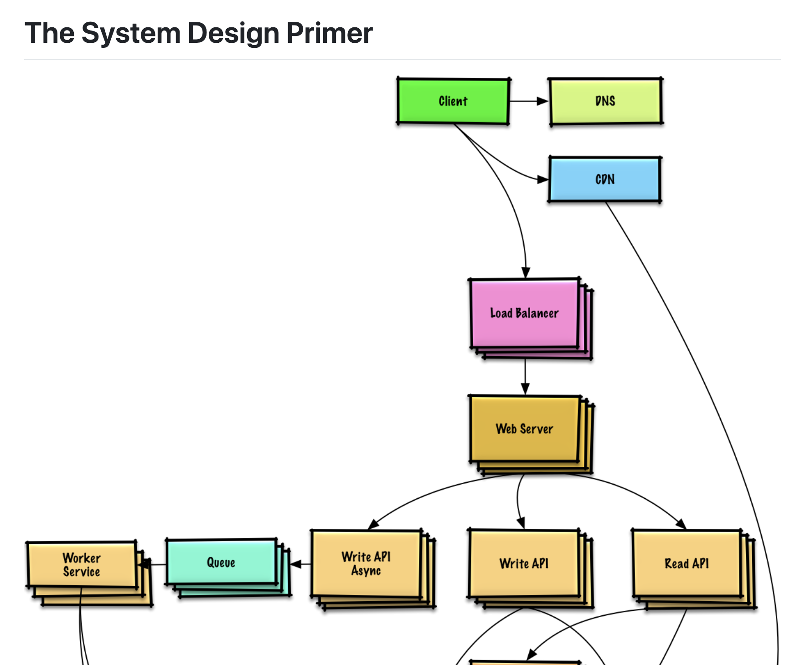

### 快速导览

| 内容                | 地址                                                         | Title / Keywords                                             |
| ------------------- | ------------------------------------------------------------ | ------------------------------------------------------------ |
| Bio生成             | https://bento.me                                             | A Link in Bio. But Rich and Beautiful.                       |
| Mac Dock toy        | https://github.com/nate-parrott/ball                         | Ball                                                         |
| System Design       | https://github.com/donnemartin/system-design-primer          | Learn how to design large-scale systems. Prep for the system design interview. Includes Anki flashcards. |
| Cloudflare 开源工具 | https://cloudflare.chuhai.tools/                             | 发现最好的Cloudflare 开源工具 & 文档                         |
| 播客推荐            | [https://www.xiaoyuzhoufm.com](https://www.xiaoyuzhoufm.com/episode/6678a2f50e3b6912d394068a) | AI的阴暗面: 繁荣背后的残障人士困境                           |

---

### 1、[Bento.me](bento.me)专门为创作者、KOL和企业家而设计的网站

可以理解为快速搭建个人门户, 管理和连接自己的Twitter、Github、Youtube等社交媒体信息。 示例↓

---

### 2、无聊但又意思的玩具 [ball](https://github.com/nate-parrott/ball)，HackNews 今日Top 1 [news.ycombinator.com/](https://news.ycombinator.com/item?id=40793465)

 

---

### 3、系统设计面试题，经典的开源项目 [system-design-primer](https://github.com/donnemartin/system-design-primer)

多语言支持、可伸缩、高并发的架构和系统设计场景。

Learn how to design large-scale systems. Prep for the system design interview. Includes Anki flashcards.

关联推荐：https://github.com/jordan-cutler/path-to-senior-engineer-handbook

 

---

### 4、[Cloudflare开源工具 & 文档](https://cloudflare.chuhai.tools/) ，当之无愧的赛博佛祖

---

### 5、播客推荐：[AI的阴暗面: 繁荣背后的残障人士困境](https://www.xiaoyuzhoufm.com/episode/6678a2f50e3b6912d394068a) From 牛油果烤面包

推荐理由：标题。 主要是标题让自己陷入思考，任何一个技术或者科技的进步，都需要有人去考虑和思考残障人士 "少数群体" 的需求，需要一个同理心的心态去做事情。满足残障人士缺少的或许是资本，但是不能以资本的角度去满足。

   

---

